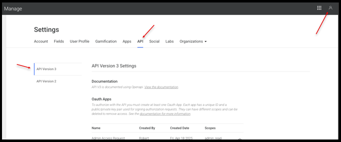
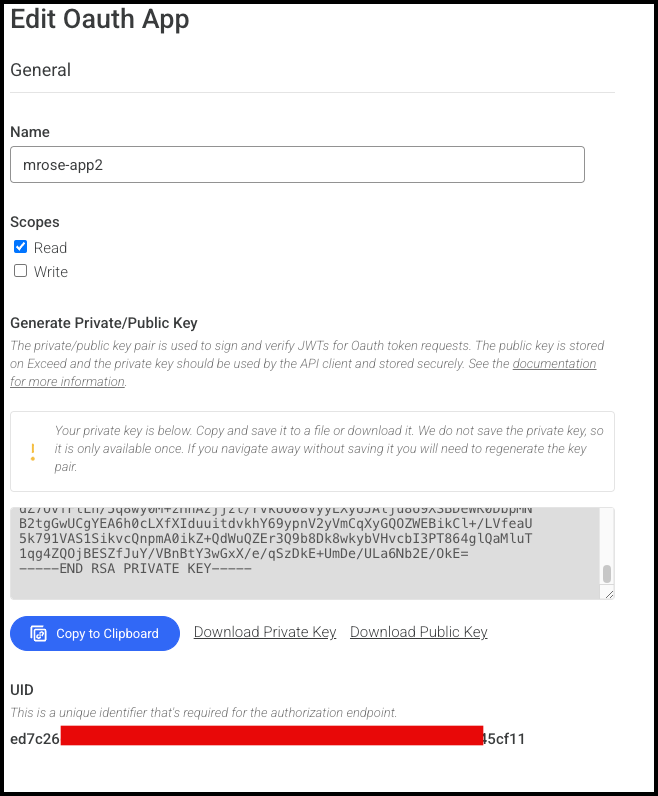
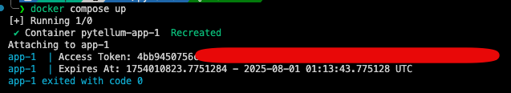

# Access Token generator for Intellum

This repo contains a container that generates an access token for Intellum.

## Installation

git clone ...

## Configuration

### Create Oauth App
Create an API UID and Private Key on Intellum.

At the time of this writing:

click Your Avatar (top right corner) > Manage > Settings > API

Scroll to the bottom and click Create Oauth App


Enter the name of your Oauth App.

Select if you want both Read, Write or both

Then Save



### Create a Private / Public Key Pair

Find the Oauth App you created in the list of app.

Save the UID into a file called: *.env*

`API_UID=<your_api_uid_here>`

Click Generate Private and Public Key

Save the Private key to the same directory as this repo. Use the filename: *private.key*




### Sample .env file

```
API_UID="xxxxxx"
PRIVATE_KEY_FILE="./private.key"
AUTH_URL="https://salespro.hpe.com/oauth2/token.json"
BASE_URL="https://salespro.hpe.com"
```

## Running the container

`docker compose up`


